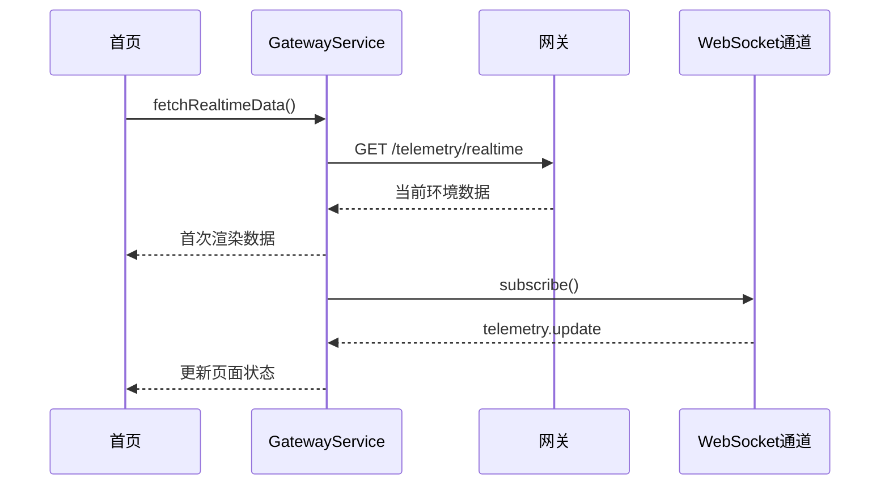
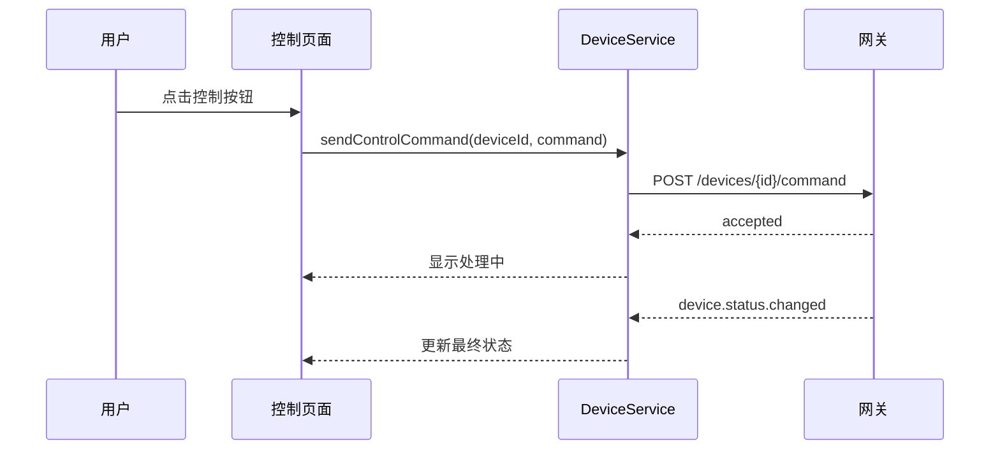

# 接口设计

| 文档版本 | V1.1 |
|---|---|
| 创建日期 | 2026-03-15 |
| 更新日期 | 2026-03-16 |
| 文档作者 | OpenCode |

## 1. 文档目的

本文档定义智慧农业控制系统 V1 的网关接口契约，统一前端、网关和测试对请求、响应、错误、状态推送和字段约束的理解。

本文档重点解决：

- 接口到底返回什么
- 失败时如何返回
- 字段是否允许为空
- 控制结果如何从“已接收”走到“最终状态”

## 2. 设计原则

- 面向网关定义统一接口，而不是直接面向单个硬件协议
- 查询接口与控制接口分离
- 控制动作必须区分“已接收”和“最终结果”
- 实时数据优先使用 WebSocket 推送，HTTP 用于首次拉取和补偿查询
- 所有字段必须可映射到统一字段字典

## 3. 通用契约

### 3.1 基础约束

- 协议：HTTP/HTTPS + WebSocket
- 编码：UTF-8
- 时间格式：ISO 8601，例如 `2026-03-15T10:01:00Z`
- 布尔字段只允许 `true` 或 `false`
- 所有枚举值采用全大写或约定好的主题名称

### 3.2 通用请求头

| 请求头 | 必填 | 说明 |
|---|---|---|
| `Content-Type` | POST 必填 | 固定为 `application/json` |
| `X-Request-Id` | 推荐 | 与请求体中的 `requestId` 保持一致，用于追踪 |
| `Authorization` | 否 | V1 可为空，预留鉴权扩展位 |

### 3.3 通用成功响应模型

列表查询除外，默认成功响应推荐采用以下结构：

```json
{
  "code": 0,
  "message": "ok",
  "requestId": "req-20260316-0001",
  "data": {}
}
```

字段说明：

| 字段 | 类型 | 必填 | 说明 |
|---|---|---|---|
| code | number | 是 | `0` 表示成功 |
| message | string | 是 | 结果说明 |
| requestId | string | 否 | 请求追踪标识 |
| data | object/array | 是 | 业务数据 |

### 3.4 通用失败响应模型

```json
{
  "code": 1002,
  "message": "device offline",
  "requestId": "req-20260316-0002",
  "details": {
    "deviceId": "pump-001"
  }
}
```

字段说明：

| 字段 | 类型 | 必填 | 说明 |
|---|---|---|---|
| code | number | 是 | 错误码 |
| message | string | 是 | 面向开发和联调的说明 |
| requestId | string | 否 | 请求追踪标识 |
| details | object | 否 | 附加错误上下文 |

### 3.5 空值和缺失字段规则

- 必填字段缺失时，接口返回 `1004` 参数非法
- 非必填字段可省略，不建议返回 `null`
- 环境指标字段允许缺失，但 `timestamp` 必须存在
- 列表接口返回空数组表示“无数据”，不应返回 `null`

## 4. 接口总览

| 分类 | 接口 | 方法 | 说明 |
|---|---|---|---|
| 网关连接 | `/gateway/status` | GET | 查询网关状态 |
| 实时数据 | `/telemetry/realtime` | GET | 查询最新环境数据 |
| 设备列表 | `/devices` | GET | 查询设备列表 |
| 设备控制 | `/devices/{id}/command` | POST | 下发设备控制命令 |
| 告警规则 | `/rules/alert` | GET/POST | 查询和保存阈值规则 |
| 联动规则 | `/rules/automation` | GET/POST | 查询和保存联动规则 |
| 历史记录 | `/history/events` | GET | 查询历史事件 |

## 5. REST 接口定义

### 5.1 查询网关状态

- 方法：`GET`
- 路径：`/gateway/status`
- 说明：用于首页和设置页判断系统是否在线

成功响应示例：

```json
{
  "code": 0,
  "message": "ok",
  "data": {
    "online": true,
    "lastHeartbeat": "2026-03-15T10:00:00Z",
    "connectedDeviceCount": 7,
    "version": "1.0.0"
  }
}
```

字段说明：

| 字段 | 类型 | 必填 | 允许为空 | 说明 |
|---|---|---|---|---|
| online | boolean | 是 | 否 | 网关是否在线 |
| lastHeartbeat | string | 是 | 否 | 最近心跳时间 |
| connectedDeviceCount | number | 是 | 否 | 已连接设备数 |
| version | string | 否 | 否 | 网关版本 |

失败响应场景：

- 网关服务不可达：返回 `1001`

### 5.2 查询实时环境数据

- 方法：`GET`
- 路径：`/telemetry/realtime`
- 说明：用于首页首屏拉取当前环境数据

成功响应示例：

```json
{
  "code": 0,
  "message": "ok",
  "data": {
    "temperature": 24.5,
    "humidity": 61.2,
    "light": 430,
    "co2": 780,
    "soilMoisture": 38.1,
    "timestamp": "2026-03-15T10:01:00Z"
  }
}
```

字段说明：

| 字段 | 类型 | 必填 | 允许为空 | 说明 |
|---|---|---|---|---|
| temperature | number | 否 | 否 | 温度，单位 `°C` |
| humidity | number | 否 | 否 | 湿度，单位 `%` |
| light | number | 否 | 否 | 光照强度，单位 `lux` |
| co2 | number | 否 | 否 | 二氧化碳浓度，单位 `ppm` |
| soilMoisture | number | 否 | 否 | 土壤湿度，单位 `%` |
| timestamp | string | 是 | 否 | 数据采集时间 |

约束：

- 允许部分指标缺失
- 当某个指标缺失时，不返回该字段即可
- `timestamp` 必须存在，否则视为非法响应

### 5.3 查询设备列表

- 方法：`GET`
- 路径：`/devices`

成功响应示例：

```json
{
  "code": 0,
  "message": "ok",
  "data": [
    {
      "id": "pump-001",
      "name": "主灌溉水泵",
      "type": "PUMP",
      "category": "ACTUATOR",
      "online": true,
      "status": "OFF",
      "level": 0,
      "location": "A区"
    }
  ]
}
```

单设备字段说明：

| 字段 | 类型 | 必填 | 允许为空 | 说明 |
|---|---|---|---|---|
| id | string | 是 | 否 | 设备唯一 ID |
| name | string | 是 | 否 | 设备名称 |
| type | string | 是 | 否 | 设备类型 |
| category | string | 是 | 否 | `SENSOR` / `ACTUATOR` |
| online | boolean | 是 | 否 | 在线状态 |
| status | string | 否 | 否 | 当前状态，例如 `ON`/`OFF` |
| level | number | 否 | 否 | 档位或亮度等级 |
| location | string | 否 | 否 | 所属区域 |

### 5.4 发送设备控制命令

- 方法：`POST`
- 路径：`/devices/{id}/command`
- 说明：用于灌溉、补光和扩展设备控制

请求示例：

```json
{
  "command": "TURN_ON",
  "params": {
    "durationSec": 30,
    "level": 3
  },
  "requestId": "cmd-20260315-0001"
}
```

请求字段说明：

| 字段 | 类型 | 必填 | 说明 |
|---|---|---|---|
| command | string | 是 | 控制命令，如 `TURN_ON`、`TURN_OFF`、`SET_LEVEL` |
| params | object | 否 | 命令附加参数 |
| requestId | string | 是 | 幂等请求唯一标识 |

成功响应示例：

```json
{
  "code": 0,
  "message": "accepted",
  "requestId": "cmd-20260315-0001",
  "data": {
    "accepted": true,
    "deviceId": "pump-001",
    "status": "ACCEPTED"
  }
}
```

响应字段说明：

| 字段 | 类型 | 必填 | 说明 |
|---|---|---|---|
| accepted | boolean | 是 | 网关是否已接收命令 |
| deviceId | string | 是 | 目标设备 |
| status | string | 是 | 初始状态，仅允许 `ACCEPTED` |

失败场景：

- 目标设备离线：`1002`
- 参数非法：`1004`
- 网关执行拒绝：`1003`

约束：

- 同一个 `requestId` 在 30 秒内必须幂等
- 初始响应只代表“命令被接收”，最终结果需由 `device.status.changed` 或超时机制补齐

### 5.5 查询告警规则

- 方法：`GET`
- 路径：`/rules/alert`

成功响应示例：

```json
{
  "code": 0,
  "message": "ok",
  "data": [
    {
      "id": "rule-alert-001",
      "name": "温度过高预警",
      "metricType": "TEMPERATURE",
      "operator": ">",
      "thresholdValue": 30,
      "level": "WARNING",
      "enabled": true
    }
  ]
}
```

### 5.6 保存告警规则

- 方法：`POST`
- 路径：`/rules/alert`

请求示例：

```json
{
  "id": "rule-alert-001",
  "name": "温度过高预警",
  "metricType": "TEMPERATURE",
  "operator": ">",
  "thresholdValue": 30,
  "level": "WARNING",
  "enabled": true
}
```

约束：

- `metricType`、`operator`、`thresholdValue`、`level` 缺一不可
- 重复规则名称允许存在，但同一指标与阈值的完全重复规则应返回 `1005`

### 5.7 查询联动规则

- 方法：`GET`
- 路径：`/rules/automation`

成功响应示例：

```json
{
  "code": 0,
  "message": "ok",
  "data": [
    {
      "id": "rule-auto-001",
      "name": "土壤湿度低自动灌溉",
      "condition": {
        "metricType": "SOIL_MOISTURE",
        "operator": "<",
        "thresholdValue": 35
      },
      "action": {
        "deviceId": "pump-001",
        "command": "TURN_ON",
        "params": {
          "durationSec": 20
        }
      },
      "enabled": true
    }
  ]
}
```

### 5.8 保存联动规则

- 方法：`POST`
- 路径：`/rules/automation`

约束：

- `condition` 和 `action` 缺一不可
- 目标设备不存在时返回 `1002` 或 `1005`
- 规则条件不完整时返回 `1004`

### 5.9 查询历史事件

- 方法：`GET`
- 路径：`/history/events`

推荐查询参数：

| 参数 | 类型 | 必填 | 说明 |
|---|---|---|---|
| type | string | 否 | `ALERT` / `COMMAND` / `RULE` |
| startTime | string | 否 | 起始时间 |
| endTime | string | 否 | 结束时间 |
| pageNo | number | 否 | 页码，从 `1` 开始 |
| pageSize | number | 否 | 页大小，默认 `20` |

成功响应示例：

```json
{
  "code": 0,
  "message": "ok",
  "data": {
    "pageNo": 1,
    "pageSize": 20,
    "total": 2,
    "list": [
      {
        "id": "cmd-001",
        "type": "COMMAND",
        "status": "SUCCESS",
        "timestamp": "2026-03-15T10:10:00Z"
      }
    ]
  }
}
```

分页约束：

- 分页接口统一返回 `pageNo`、`pageSize`、`total`、`list`
- 无结果时 `list` 返回空数组

## 6. WebSocket 推送设计

### 6.1 推送主题

- `telemetry.update`
- `device.status.changed`
- `alert.created`
- `rule.executed`

### 6.2 推送消息统一格式

```json
{
  "topic": "device.status.changed",
  "timestamp": "2026-03-15T10:05:00Z",
  "data": {}
}
```

字段说明：

| 字段 | 类型 | 必填 | 说明 |
|---|---|---|---|
| topic | string | 是 | 推送主题 |
| timestamp | string | 是 | 服务端推送时间 |
| data | object | 是 | 推送内容 |

### 6.3 推荐主题负载

#### `telemetry.update`

用于环境实时数据推送，结构与 `/telemetry/realtime` 的 `data` 一致。

#### `device.status.changed`

示例：

```json
{
  "topic": "device.status.changed",
  "timestamp": "2026-03-15T10:05:00Z",
  "data": {
    "deviceId": "pump-001",
    "status": "ON",
    "resultStatus": "SUCCESS",
    "requestId": "cmd-20260315-0001"
  }
}
```

#### `alert.created`

用于告警新增推送，至少包含 `id`、`level`、`message`、`triggeredValue`、`timestamp`。

#### `rule.executed`

用于自动规则执行结果推送，至少包含 `ruleId`、`deviceId`、`resultStatus`、`timestamp`。

## 7. 错误码设计

| 错误码 | 含义 | 说明 |
|---|---|---|
| 1001 | 网关离线 | 无法连接网关 |
| 1002 | 设备离线或不存在 | 目标设备不可执行 |
| 1003 | 命令执行失败 | 网关执行失败或超时 |
| 1004 | 参数非法 | 请求参数不完整或不合法 |
| 1005 | 规则配置冲突 | 规则条件冲突或目标设备冲突 |

## 8. 接口时序补充

### 8.1 实时数据拉取与订阅时序



### 8.2 设备控制时序



## 9. 变更记录

| 版本 | 日期 | 变更内容 | 作者 |
|---|---|---|---|
| V1.0 | 2026-03-15 | 初始版本 | OpenCode |
| V1.1 | 2026-03-16 | 补充统一响应模型、错误模型、字段约束、分页结构和控制契约 | OpenCode |
