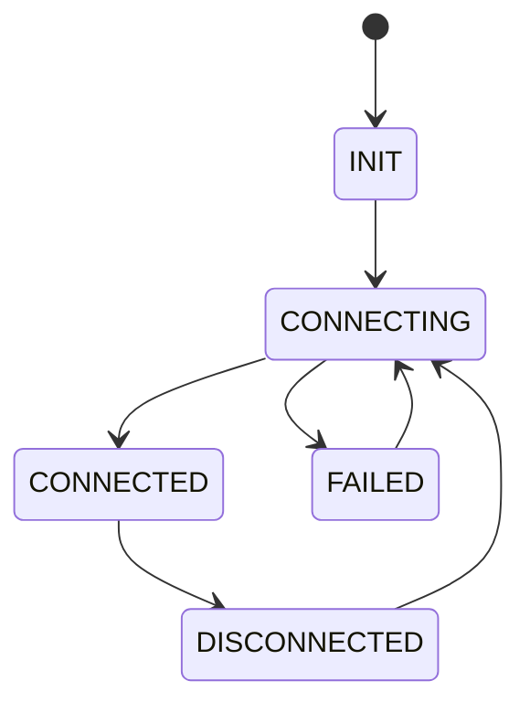
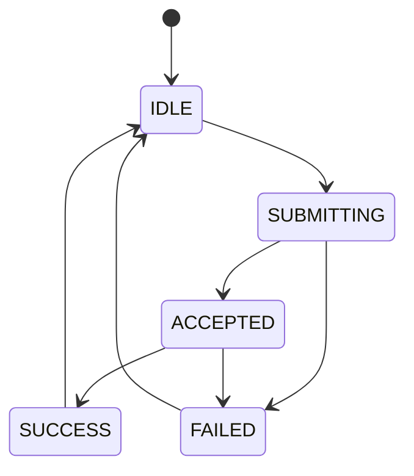
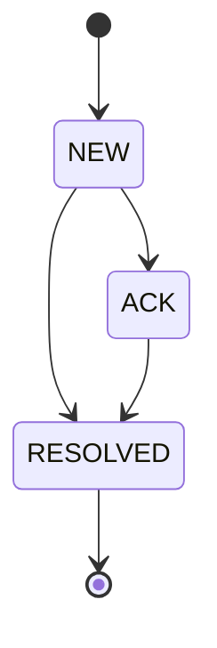
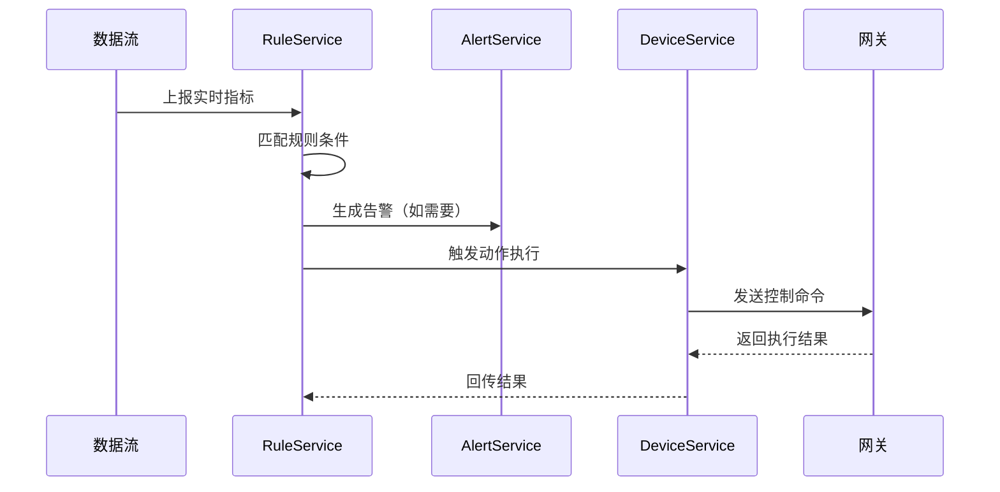
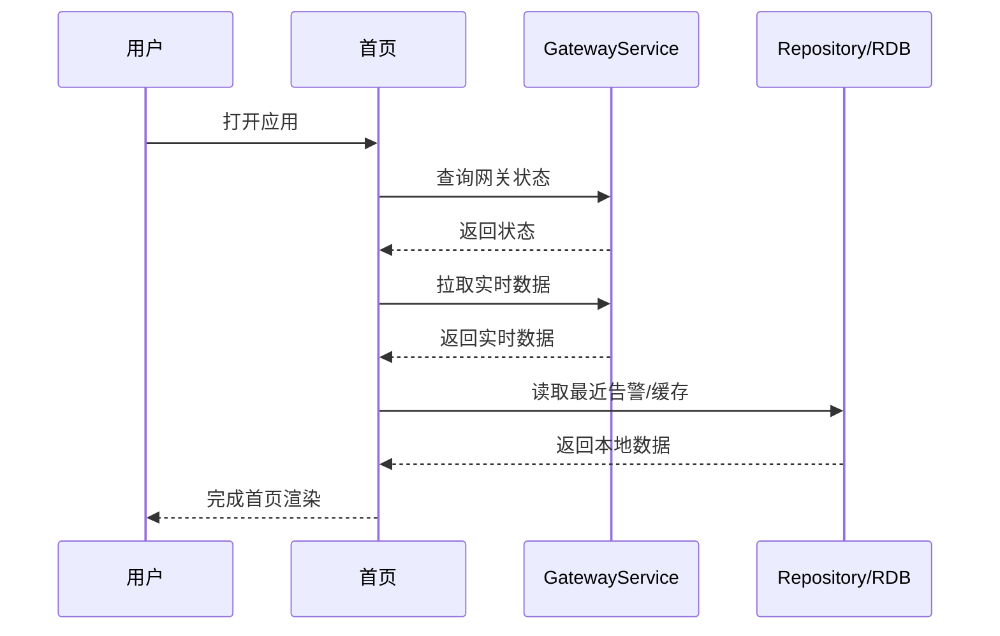
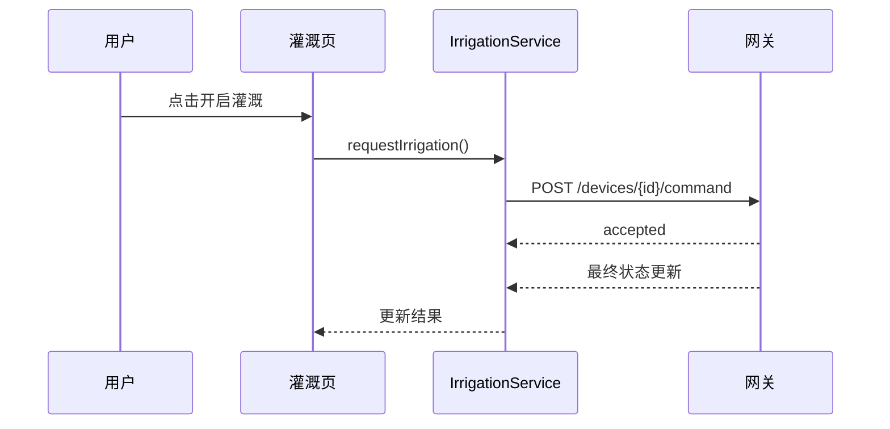

# 状态机与时序专项

## 1. 文档目的

统一展示系统中关键状态机和关键交互时序，便于设计评审、联调和答辩说明。

## 2. 网关连接状态机

状态说明：

- `INIT`：应用刚启动，尚未尝试连接
- `CONNECTING`：正在连接网关
- `CONNECTED`：连接成功
- `FAILED`：连接失败
- `DISCONNECTED`：连接断开

## 3. 控制命令状态机

状态说明：

- `IDLE`：未发起控制
- `SUBMITTING`：命令发送中
- `ACCEPTED`：网关已接收命令
- `SUCCESS`：设备状态已确认变更
- `FAILED`：命令失败或超时

## 4. 告警事件状态机

## 5. 自动规则执行时序

## 6. 首页加载时序

## 7. 手动灌溉控制时序

