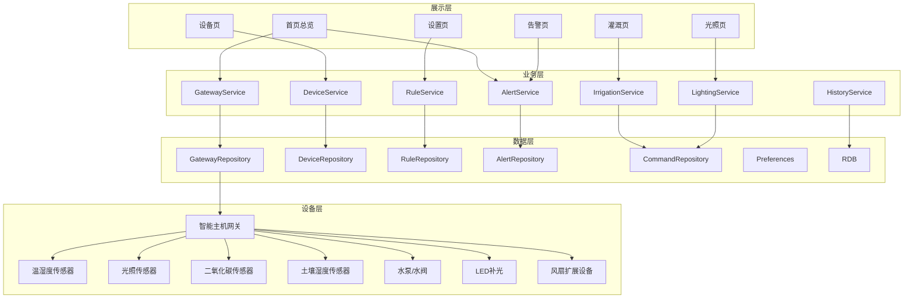

# 智慧农业控制系统总体设计

| 文档版本 | V1.1 |
|---|---|
| 创建日期 | 2026-03-15 |
| 更新日期 | 2026-03-16 |
| 文档作者 | OpenCode |

## 1. 文档目的

本文档用于从系统层面说明智慧农业控制系统 V1 的整体架构、范围边界、分层关系、关键设计决策、运行与降级策略，作为后续概要设计、详细设计、接口设计和数据库设计的上层约束。

## 2. 设计目标与边界

### 2.1 V1 架构目标

- 支撑首页看数、手动灌溉、手动补光、基础告警和扩展设备接入
- 优先保障主演示路径稳定，而不是追求大而全平台能力
- 通过统一网关协议和设备抽象降低设备侧耦合
- 允许在硬件不稳定时通过 mock 网关完成主路径验证

### 2.2 非目标范围

V1 不覆盖以下内容：

- 重型后台管理平台
- 多温室统一运营管理
- 复杂报表分析系统
- 多租户或多角色权限平台

## 3. 架构背景与方案选择

### 3.1 问题背景

本系统面向智慧农业监测与控制场景，重点解决以下问题：

- 农业环境数据分散且不易实时查看
- 设备控制和状态反馈不闭环
- 人工巡检频繁、自动化程度低
- 比赛项目需要同时体现系统完整性和 OpenHarmony 原生能力

### 3.2 方案选择结论

结合竞品分析和项目目标，V1 明确采用以下技术与系统方案：

- Stage 模型组织工程
- `UIAbility` 承载主界面
- ArkTS + ArkUI 完成交互实现
- Preferences + RDB 完成本地配置和结构化持久化
- HTTP 承担查询和控制命令
- WebSocket 承担实时状态推送

选择原因：

- 贴合 OpenHarmony 原生能力展示
- 便于控制链路闭环设计
- 便于在硬件不稳定时做 mock 替代

## 4. 总体架构

### 4.1 分层架构

- 展示层：负责 UI、交互、状态反馈和页面降级展示
- 业务层：负责灌溉、补光、告警、规则等业务逻辑
- 数据层：负责网关通信、本地存储、状态同步和缓存
- 设备层：由网关统一接入和抽象，不直接暴露给页面

### 4.2 逻辑视图



### 4.3 部署视图

```text
OpenHarmony 设备
├─ 智慧农业控制 APP
│  ├─ 页面层
│  ├─ 业务服务层
│  ├─ 本地 Preferences
│  └─ 本地 RDB
└─ 网络连接
   └─ 智能主机网关
      ├─ 设备注册管理
      ├─ 协议适配
      ├─ 指令执行
      └─ 状态回传
```

### 4.4 开发视图

```text
entry/
├─ ets/
│  ├─ pages/
│  ├─ components/
│  ├─ services/
│  ├─ repositories/
│  ├─ domain/
│  ├─ models/
│  └─ state/
└─ resources/
```

## 5. MVP 与增强范围在架构中的体现

### 5.1 MVP 对应模块

- 首页总览：DashboardModule + GatewayService + DeviceService
- 手动灌溉：IrrigationService + CommandRepository
- 手动补光：LightingService + CommandRepository
- 基础告警：AlertService + AlertRepository
- 扩展设备接入：DeviceService + 统一 DeviceType 扩展机制

### 5.2 增强项对应模块

- 自动补光：RuleService + LightingService
- 联动规则：RuleService + CommandRepository
- 历史记录：HistoryService + RDB 查询

架构要求：增强项必须建立在 MVP 稳定基础上实现，不能反向破坏主路径。

## 6. 关键设计决策

### 决策 1：采用单 `UIAbility` + 多页面模式

- 原因：比赛项目单任务主流程明显，单 `UIAbility` 更简单
- 影响：状态共享更直接，页面切换成本更低

### 决策 2：网关统一设备协议

- 原因：APP 不应直接耦合底层多协议设备
- 影响：APP 与硬件解耦，扩展设备接入成本更低

### 决策 3：控制结果分为“已接收”和“最终状态”

- 原因：控制接口初始响应无法保证设备已真正执行完成
- 影响：页面必须支持 `submitting/accepted/success/failed` 分阶段展示

### 决策 4：本地持久化采用 Preferences + RDB 组合

- 原因：轻量配置与结构化历史数据职责不同
- 影响：配置与记录分离，后续更易维护

### 决策 5：降级优先保障主路径

- 原因：比赛项目首先要保证演示稳定性
- 影响：当硬件、推送或增强项出现风险时，应优先保住首页、灌溉和补光主路径

## 7. 模块边界说明

| 模块 | 负责内容 | 不负责内容 |
|---|---|---|
| DashboardModule | 环境总览、网关状态、设备摘要、告警摘要 | 复杂规则编辑 |
| DeviceModule | 设备展示、设备详情、基础控制入口 | 自动策略判定 |
| IrrigationService | 灌溉建议、灌溉控制、提交中与结果反馈 | 光照策略 |
| LightingService | 手动补光、亮度逻辑、自动补光配合 | 灌溉计算 |
| AlertService | 阈值扫描、告警事件生成、状态更新 | 设备协议转换 |
| RuleService | 条件-动作规则计算、规则冲突留痕 | 页面渲染 |
| GatewayService | 连接管理、HTTP/WebSocket 封装、状态同步 | 页面业务状态决策 |
| HistoryService | 控制、告警、规则执行记录查询 | 主流程控制 |

## 8. 关键运行流程

### 8.1 首页启动流程

1. 应用启动并初始化本地配置
2. 加载网关配置并尝试建立连接
3. 获取网关状态
4. 拉取首屏环境数据和设备摘要
5. 首屏渲染完成
6. 建立 WebSocket 订阅通道

### 8.2 手动控制流程

1. 用户触发控制动作
2. 页面校验设备在线状态和参数合法性
3. GatewayService 发送控制命令
4. 页面进入 `submitting`
5. 初始响应返回 `accepted`
6. 等待 `device.status.changed` 或超时结果
7. 页面进入 `success` 或 `failed`

### 8.3 规则执行流程

1. 实时数据到达
2. RuleService 判断是否满足规则条件
3. 如满足则生成动作命令
4. GatewayService 执行动作
5. 写入规则执行记录
6. 若失败则写入失败状态与原因

## 9. 数据模型概览

核心模型包括：

- Device
- SensorReading
- AlertRule
- AlertEvent
- AutomationRule
- CommandRecord
- GatewayConfig

### 9.1 模型关系说明

| 模型 | 说明 | 关联 |
|---|---|---|
| Device | 接入设备统一模型 | 与 SensorReading、CommandRecord、AlertEvent 关联 |
| SensorReading | 传感器采样记录 | 关联 Device |
| AlertRule | 阈值告警规则 | 触发 AlertEvent |
| AlertEvent | 告警事件记录 | 来源于 AlertRule 或系统异常 |
| AutomationRule | 联动规则 | 触发 CommandRecord |
| CommandRecord | 控制日志 | 来源于人工或自动规则 |
| GatewayConfig | 网关连接配置 | 为通信模块提供基础参数 |

## 10. 降级与可靠性设计

### 10.1 降级策略

- 网关离线：页面进入离线态，展示缓存数据或缺省态
- WebSocket 不可用：保留 HTTP 轮询兜底
- 单数据项异常：仅降级该指标卡片，不降级全局页面
- 扩展设备不可用：不阻塞首页和核心控制主路径

### 10.2 可靠性设计

- 控制动作写入日志表便于追踪
- 规则执行结果保留记录便于回溯
- 页面必须区分“处理中”和“执行失败”

### 10.3 安全与隐私设计

- 关键控制操作明确状态提示
- 保留请求鉴权扩展位
- 页面不直接感知底层硬件协议细节

## 11. 实施优先顺序

1. 网关连接与首页展示
2. 设备列表与设备状态
3. 灌溉控制
4. 手动补光控制
5. 告警规则与告警页
6. 扩展设备接入
7. 自动补光与联动规则
8. 历史记录与页面优化

## 12. 交付节奏建议

- 第一轮交付：文档冻结 + 需求闭环
- 第二轮交付：首页看数 + 控制闭环
- 第三轮交付：告警 + 扩展设备 + 异常态
- 第四轮交付：增强项 + 测试 + 演示材料收口

## 13. 附录

- 参考 PRD：`doc/product/PRD_智慧农业控制系统.md`
- 参考接口：`doc/design/接口设计.md`
- 参考页面：`doc/design/页面详细规格.md`

## 14. 变更记录

| 版本 | 日期 | 变更内容 | 作者 |
|---|---|---|---|
| V1.0 | 2026-03-15 | 初始版本 | OpenCode |
| V1.1 | 2026-03-16 | 对齐 V1 范围边界，补充 MVP/增强映射、运行流程、降级策略和模块边界 | OpenCode |
