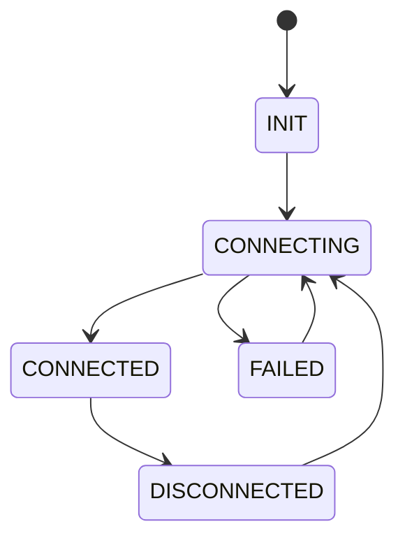
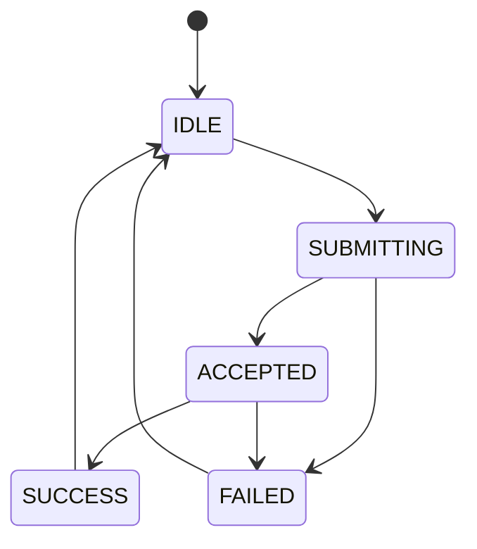
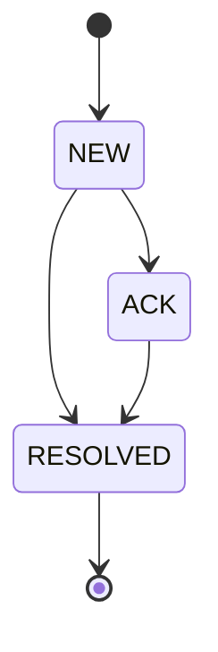
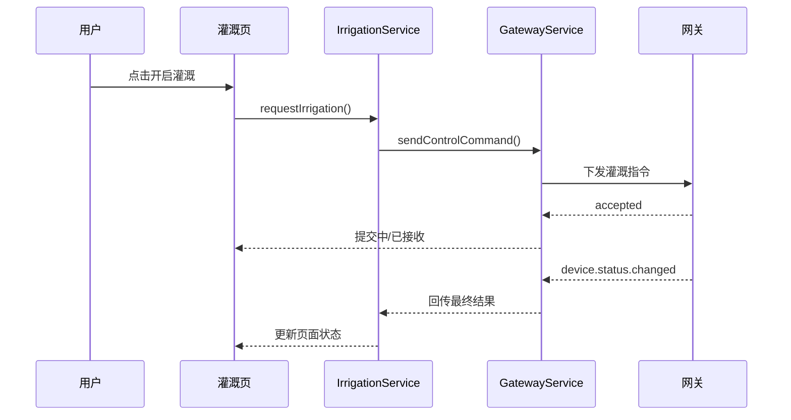
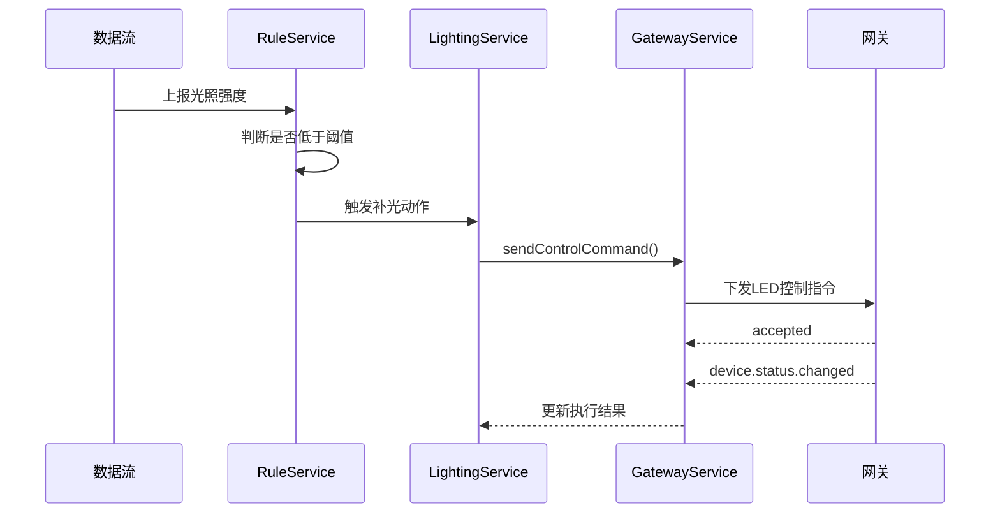
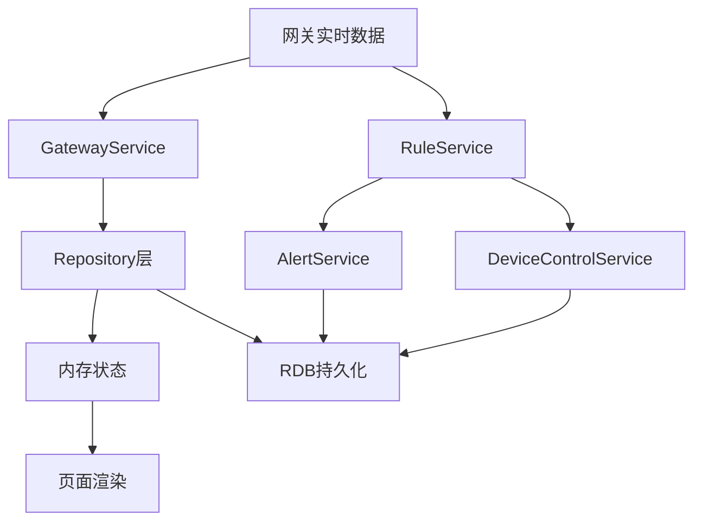

# 软件系统详细设计

| 文档版本 | V1.1 |
|---|---|
| 创建日期 | 2026-03-15 |
| 更新日期 | 2026-03-16 |
| 文档作者 | OpenCode |

## 1. 概述

本文档对系统的软件模块、职责边界、状态流转、规则约束、异常处理和扩展机制进行详细说明。

## 2. 模块定义

### 2.1 DashboardModule

职责：

- 展示环境总览
- 展示网关状态和设备在线状态
- 展示最新告警和快捷控制入口

输入：

- 实时环境数据
- 网关状态数据
- 设备状态数据
- 最新告警数据

输出：

- 首页卡片展示
- 异常摘要
- 快捷跳转入口

边界说明：

- 只负责展示和首页级聚合，不负责规则编辑

### 2.2 DeviceModule

职责：

- 展示设备列表和详情
- 提供手动控制入口
- 展示设备状态反馈

输入：

- 设备列表数据
- 设备状态变化事件

输出：

- 设备卡片
- 控制结果反馈

边界说明：

- 不负责自动规则判定

### 2.3 IrrigationModule

职责：

- 处理土壤湿度展示
- 提供灌溉控制和灌溉建议
- 展示灌溉记录

输入：

- 土壤湿度值
- 设备状态
- 灌溉策略配置

输出：

- 建议灌溉动作
- 手动控制结果
- 灌溉记录视图

边界说明：

- 不负责光照策略

### 2.4 LightingModule

职责：

- 展示光照数据
- 提供补光控制和亮度调节
- 管理自动补光策略配合展示

输入：

- 光照强度
- LED 当前状态
- 自动补光阈值

输出：

- 亮度控制结果
- 自动补光执行结果

边界说明：

- 不负责灌溉计算

### 2.5 AlertModule

职责：

- 展示告警列表
- 展示告警等级和处理状态
- 提供告警详情展示

输入：

- 告警事件流
- 告警规则数据

输出：

- 告警列表
- 告警详情
- 告警状态视图

边界说明：

- 不负责设备协议转换

### 2.6 SettingsModule

职责：

- 管理网关连接信息
- 配置阈值规则
- 配置联动规则
- 管理扩展设备接入参数

输入：

- 网关配置
- 告警规则
- 联动规则
- 扩展设备配置

输出：

- 配置保存结果
- 规则启停状态

边界说明：

- 不承担实际规则执行

## 3. 核心服务定义

### 3.1 GatewayService

职责：

- 建立与网关的连接
- 封装 HTTP 和 WebSocket 通道
- 统一输出网关数据

接口建议：

- `connect()`
- `disconnect()`
- `fetchGatewayStatus()`
- `fetchRealtimeData()`
- `sendControlCommand()`
- `subscribeStatus()`

约束：

- 控制命令必须带 `requestId`
- 初始响应仅表示 `ACCEPTED`

### 3.2 DeviceService

职责：

- 管理设备列表
- 管理设备在线状态
- 提供控制前校验

输入：

- `/devices` 查询结果
- `device.status.changed` 推送结果

输出：

- 标准化设备模型
- 控制前校验结果

约束：

- 设备离线时必须禁止控制

### 3.3 IrrigationService

职责：

- 根据土壤湿度和规则生成灌溉建议
- 执行灌溉动作
- 记录灌溉日志

策略说明：

- 当土壤湿度低于阈值且自动灌溉开启时，可生成自动控制建议
- 当用户手动执行灌溉时，优先级高于自动规则的一次执行
- 同一时刻不允许重复提交相同灌溉命令

### 3.4 LightingService

职责：

- 管理补光模式
- 管理亮度等级
- 记录补光动作

策略说明：

- 自动模式下依据光照阈值判断是否补光
- 手动模式下允许用户直接设定亮度等级
- 手动操作期间自动规则不应立即覆盖本次手动结果

### 3.5 AlertService

职责：

- 扫描阈值规则
- 生成告警事件
- 更新告警处理状态

处理说明：

- 新告警进入 `NEW` 状态
- 用户确认后进入 `ACK` 状态
- 条件恢复后可进入 `RESOLVED` 状态

### 3.6 RuleService

职责：

- 管理条件-动作联动规则
- 计算规则触发结果
- 调用对应动作执行逻辑
- 对冲突、失败和无效规则留痕

规则模型：

- 条件：指标、比较符、阈值、时间范围、启用状态
- 动作：目标设备、命令类型、参数、延时

规则约束：

- 规则条件不完整时禁止保存
- 关联设备不存在或离线时，执行结果记录为 `FAILED`
- 同一设备同一时刻只允许一个生效动作

### 3.7 HistoryService

职责：

- 查询控制记录、告警记录和规则执行记录
- 向页面提供统一分页查询结果

约束：

- 不负责生成记录，只负责查询和聚合输出

## 4. 状态机设计

### 4.1 网关连接状态机

### 4.2 设备控制状态机

状态说明：

- `SUBMITTING`：请求已发出，等待网关接收
- `ACCEPTED`：网关已接收命令，但设备最终结果未确认
- `SUCCESS`：设备最终状态已确认成功
- `FAILED`：命令失败、设备拒绝或超时

### 4.3 告警状态机

## 5. 关键时序设计

### 5.1 手动灌溉时序图

### 5.2 自动补光时序图

## 6. 异常处理设计

### 6.1 网关异常

- 页面显示离线提示
- 关键控制入口禁用或提示风险
- 支持用户手动重试连接

### 6.2 设备异常

- 设备卡片显示离线或异常
- 记录异常事件或失败状态
- 不影响其他设备正常展示

### 6.3 数据异常

- 缺失数据以占位态展示
- 记录采集异常信息
- 不阻塞页面整体渲染

### 6.4 规则异常

- 规则条件不完整时禁止保存
- 规则引用设备不存在时标记无效
- 冲突规则执行结果需留痕

## 7. 扩展性设计

- 新设备通过统一 `DeviceType` 扩展
- 新规则通过条件枚举和动作枚举扩展
- 页面层不直接依赖底层协议实现
- 历史记录统一通过 `HistoryService` 扩展查询类型

## 8. 页面级状态设计

### 8.1 首页状态

- `loading`
- `ready`
- `partial_error`
- `offline`

### 8.2 设备控制状态

- `idle`
- `submitting`
- `accepted`
- `success`
- `failed`

### 8.3 告警页状态

- `empty`
- `list_ready`
- `filtering`
- `detail_open`

## 9. 数据流设计

## 10. 变更记录

| 版本 | 日期 | 变更内容 | 作者 |
|---|---|---|---|
| V1.0 | 2026-03-15 | 初始版本 | OpenCode |
| V1.1 | 2026-03-16 | 对齐 accepted/final 状态模型，补充规则约束、模块边界和异常处理细节 | OpenCode |
